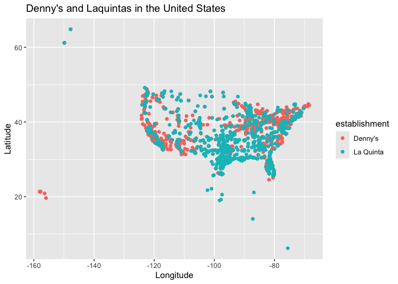
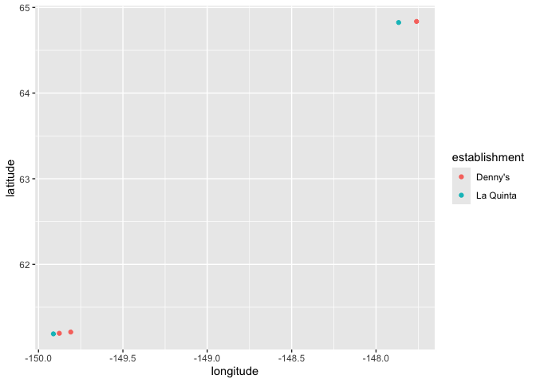
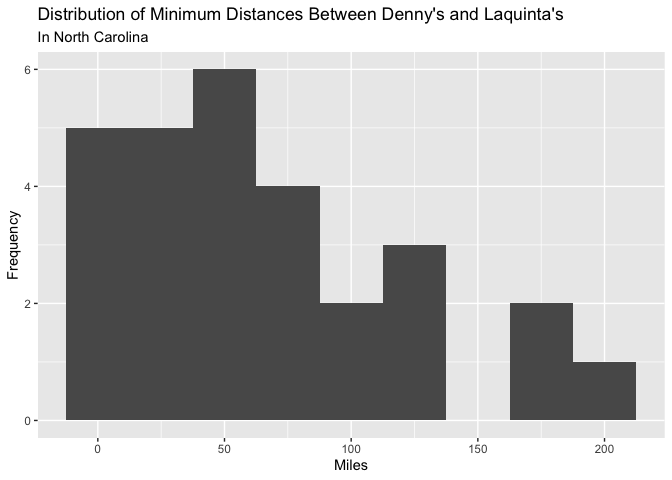
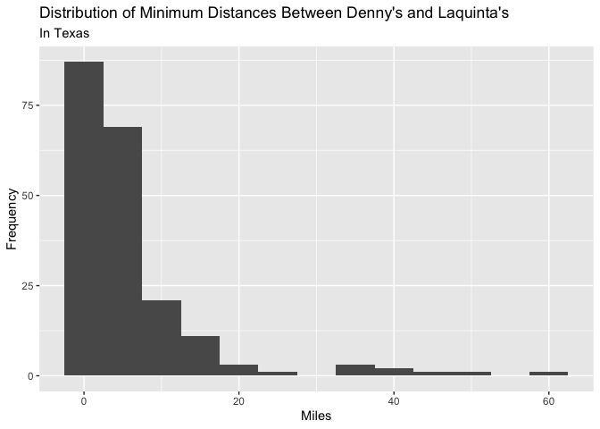
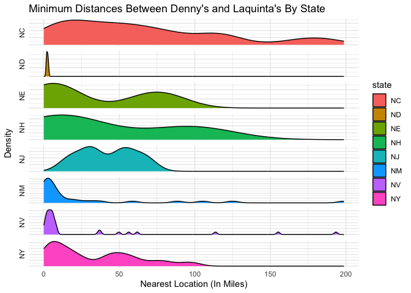

Lab 05 - La Quinta is Spanish for next to Denny’s, Pt. 2
================
Cailey Fay
10.14.25

### Load packages and data

``` r
library(tidyverse) 
library(dsbox) 
library(lemon)
```

``` r
states <- read_csv("data/states.csv")
```

### Exercise 1

``` r
dn_ak <- dennys %>%
  filter(state == "AK")
nrow(dn_ak)
```

    ## [1] 3

``` r
lq_ak <- laquinta %>%
  filter(state == "AK")

nrow(lq_ak)
```

    ## [1] 2

There are 3 Denny’s and 2 Laquinta’s in Alaska.

### Exercise 2

There are 6 Pairings.

``` r
pairings <- nrow(dn_ak)*nrow(lq_ak)
```

### Exercise 3 and 4

``` r
dn_lq_ak <- full_join(dn_ak, lq_ak,
  by = "state")
```

    ## Warning in full_join(dn_ak, lq_ak, by = "state"): Detected an unexpected many-to-many relationship between `x` and `y`.
    ## ℹ Row 1 of `x` matches multiple rows in `y`.
    ## ℹ Row 1 of `y` matches multiple rows in `x`.
    ## ℹ If a many-to-many relationship is expected, set `relationship =
    ##   "many-to-many"` to silence this warning.

``` r
dn_lq_ak
```

    ## # A tibble: 6 × 11
    ##   address.x     city.x state zip.x longitude.x latitude.x address.y city.y zip.y
    ##   <chr>         <chr>  <chr> <chr>       <dbl>      <dbl> <chr>     <chr>  <chr>
    ## 1 2900 Denali   Ancho… AK    99503       -150.       61.2 3501 Min… "\nAn… 99503
    ## 2 2900 Denali   Ancho… AK    99503       -150.       61.2 4920 Dal… "\nFa… 99709
    ## 3 3850 Debarr … Ancho… AK    99508       -150.       61.2 3501 Min… "\nAn… 99503
    ## 4 3850 Debarr … Ancho… AK    99508       -150.       61.2 4920 Dal… "\nFa… 99709
    ## 5 1929 Airport… Fairb… AK    99701       -148.       64.8 3501 Min… "\nAn… 99503
    ## 6 1929 Airport… Fairb… AK    99701       -148.       64.8 4920 Dal… "\nFa… 99709
    ## # ℹ 2 more variables: longitude.y <dbl>, latitude.y <dbl>

There are 6 observations, each representing a denny’s and laquinta
pairing in Alaska.

### Exercise 5

We use the mutate function!

``` r
haversine <- function(long1, lat1, long2, lat2, round = 3) {
  # convert to radians
  long1 <- long1 * pi / 180
  lat1 <- lat1 * pi / 180
  long2 <- long2 * pi / 180
  lat2 <- lat2 * pi / 180

  R <- 6371 # Earth mean radius in km

  a <- sin((lat2 - lat1) / 2)^2 + cos(lat1) * cos(lat2) * sin((long2 - long1) / 2)^2
  d <- R * 2 * asin(sqrt(a))

  return(round(d, round)) # distance in km
}
```

…

### Exercise 6

``` r
dn_lq_ak <- dn_lq_ak %>%
  mutate(distance = haversine(longitude.x,latitude.x,longitude.y,latitude.y))
```

… \### Exercise 7

``` r
dn_lq_ak_mindist <- dn_lq_ak %>%
  group_by(address.x) %>%
  summarize(closest = min(distance))
```

### Exercise 8

``` r
#From Lab 4, visualization of Dennys and Laquintas throughout the United States.
dn <- dennys %>%
  mutate(establishment = "Denny's")

lq <- laquinta %>%
  mutate(establishment = "La Quinta")

dn_lq <- bind_rows(dn, lq)

ggplot(dn_lq, mapping = aes(
  x = longitude,
  y = latitude,
  color = establishment
)) +
  geom_point() +
  labs(title = "Denny's and Laquintas in the United States",
       x = "Longitude",
       y = "Latitude")
```

<!-- -->

``` r
# Looking at the map of Alaska only. 
AKonly <- dn_lq %>%
  filter(state == "AK")
ggplot(AKonly, mapping = aes(
  x = longitude,
  y = latitude,
  color = establishment
)) +
  geom_point()  +
  labs(title = "Denny's and Laquintas in Alaska",
       x = "Longitude",
       y = "Latitude")
```

<!-- -->

Every Denny’s has a Laquinta within six miles, according to the minimum
distance variable created in exercise 7. The average distance is 4.41
with a standard deviation of 2.09544.

### Exercise 9

``` r
dn_nc <- dennys %>%
  filter(state == "NC")

lq_nc <- laquinta %>%
  filter(state == "NC")

dn_lq_nc <- full_join(dn_nc, lq_nc,
  by = "state")
```

    ## Warning in full_join(dn_nc, lq_nc, by = "state"): Detected an unexpected many-to-many relationship between `x` and `y`.
    ## ℹ Row 1 of `x` matches multiple rows in `y`.
    ## ℹ Row 1 of `y` matches multiple rows in `x`.
    ## ℹ If a many-to-many relationship is expected, set `relationship =
    ##   "many-to-many"` to silence this warning.

``` r
dn_lq_nc <- dn_lq_nc %>%
  mutate(distance = haversine(longitude.x,latitude.x,longitude.y,latitude.y))

dn_lq_nc_mindist <- dn_lq_nc %>%
  group_by(address.x) %>%
  summarize(closest = min(distance))

dn_lq_nc_mindist %>%
  ggplot(aes(x=closest)) +
  geom_histogram(binwidth = 25) +
  labs(title ="Distribution of Minimum Distances Between Denny's and Laquinta's",
       subtitle = "In North Carolina",
       x= "Miles",
       y = "Frequency")
```

<!-- -->

On average, there is an Laquinta within 65.4443214 miles of a dennys,
with a standard deviation of 53.423978. This distribution is much more
spread out than alaska, with some “nearest pairings” close by, and
others really far apart. The farthest Denny’s to a Laquinta is 187
miles.

### Exercise 10

``` r
dn_tx <- dennys %>%
  filter(state == "TX")

lq_tx <- laquinta %>%
  filter(state == "TX")

dn_lq_tx <- full_join(dn_tx, lq_tx,
  by = "state")
```

    ## Warning in full_join(dn_tx, lq_tx, by = "state"): Detected an unexpected many-to-many relationship between `x` and `y`.
    ## ℹ Row 1 of `x` matches multiple rows in `y`.
    ## ℹ Row 1 of `y` matches multiple rows in `x`.
    ## ℹ If a many-to-many relationship is expected, set `relationship =
    ##   "many-to-many"` to silence this warning.

``` r
dn_lq_tx <- dn_lq_tx %>%
  mutate(distance = haversine(longitude.x,latitude.x,longitude.y,latitude.y))

dn_lq_tx_mindist <- dn_lq_tx %>%
  group_by(address.x) %>%
  summarize(closest = min(distance))

dn_lq_tx_mindist %>%
  ggplot(aes(x=closest)) +
  geom_density() +
   labs(title ="Distribution of Minimum Distances Between Denny's and Laquinta's",
       subtitle = "In Texas",
       x= "Miles",
       y = "Frequency")
```

<!-- -->

On average, there is an Laquinta within 5.7918 miles of a dennys, with a
standard deviation of 8.8307149. This distribution is much more
condensed than North Carolina, with some “nearest pairings” close by,
and others really far apart. The farthest Denny’s to a Laquinta is 60
miles, but many locations are within 1/2 a mile.

### Exercise 11

``` r
dn_fl <- dennys %>%
  filter(state == "FL")

lq_fl <- laquinta %>%
  filter(state == "FL")

dn_lq_fl <- full_join(dn_fl, lq_fl,
  by = "state")
```

    ## Warning in full_join(dn_fl, lq_fl, by = "state"): Detected an unexpected many-to-many relationship between `x` and `y`.
    ## ℹ Row 1 of `x` matches multiple rows in `y`.
    ## ℹ Row 1 of `y` matches multiple rows in `x`.
    ## ℹ If a many-to-many relationship is expected, set `relationship =
    ##   "many-to-many"` to silence this warning.

``` r
dn_lq_fl <- dn_lq_fl %>%
  mutate(distance = haversine(longitude.x,latitude.x,longitude.y,latitude.y))

dn_lq_fl_mindist <- dn_lq_fl %>%
  group_by(address.x) %>%
  summarize(closest = min(distance))

dn_lq_fl_mindist %>%
  ggplot(aes(x=closest)) +
  geom_density() +
   labs(title ="Distribution of Minimum Distances Between Denny's and Laquinta's",
       subtitle = "In Florida",
       x= "Miles",
       y = "Frequency")
```

<!-- -->

On average, there is an Laquinta within 13.4830935 miles of a dennys,
with a standard deviation of 19.223176. This distribution is much more
condensed than North Carolina, with some “nearest pairings” close by,
and others really far apart. The farthest Denny’s to a Laquinta is 176
miles, but many locations are within a mile or two. The 176 mile one is
very much an outlier, as is the one that is 90 miles away.

### Exercise 12

I think the joke is most true for Texas, because the proportion of
Denny’s within a mile from a Laquinta is greatest, adjusting for the
total number of Dennys in the state. 56/200 are within a mile in Texas,
whereas 13/139 are within a mile in Florida.

``` r
dn_lq_ak_mindist %>%
  filter(closest < 1) %>%
  count()
```

    ## # A tibble: 1 × 1
    ##       n
    ##   <int>
    ## 1     0

``` r
#none are within 0 miles in Alaska 

dn_lq_nc_mindist %>%
  filter(closest < 1) %>%
  count()
```

    ## # A tibble: 1 × 1
    ##       n
    ##   <int>
    ## 1     0

``` r
#none are within 0 miles in North Carolina 

dn_lq_tx_mindist %>%
  filter(closest < 1) %>%
  count()
```

    ## # A tibble: 1 × 1
    ##       n
    ##   <int>
    ## 1    56

``` r
#there are 56 within 0 miles in Texas 
#out of 200

dn_lq_fl_mindist %>%
  filter(closest < 1) %>%
  count()
```

    ## # A tibble: 1 × 1
    ##       n
    ##   <int>
    ## 1    16

``` r
#There are 16 within 0 miles in Florida 
# out of 139
```

### Trying to recreate those plots: Not quite recreated but as much time as I am willing to invest.

``` r
dn_lq_dist <- full_join(dn, lq, by = "state")
```

    ## Warning in full_join(dn, lq, by = "state"): Detected an unexpected many-to-many relationship between `x` and `y`.
    ## ℹ Row 1 of `x` matches multiple rows in `y`.
    ## ℹ Row 23 of `y` matches multiple rows in `x`.
    ## ℹ If a many-to-many relationship is expected, set `relationship =
    ##   "many-to-many"` to silence this warning.

``` r
dn_lq_dist <- dn_lq_dist %>%
  mutate(distance = haversine(longitude.x,latitude.x,longitude.y,latitude.y))

dn_lq_mindist <- dn_lq_dist %>%
  group_by(address.x) %>%
  mutate(closest = min(distance))

dn_lq_mindist %>%
  filter(state %in% c("NC","ND","NE","NH","NJ","NM","NV","NY")) %>%
  ggplot(aes(x=closest, fill=state)) +
  geom_density() +
  facet_grid(state ~ ., switch = "y", scales = "free_y") +
  theme_minimal() +
  theme(axis.text.y = element_blank()) +
  labs(title = "Minimum Distances Between Denny's and Laquinta's By State",
       x = "Nearest Location (In Miles)",
       y = "Density",
       legend = "State")
```

    ## Ignoring unknown labels:
    ## • legend : "State"

<!-- -->
